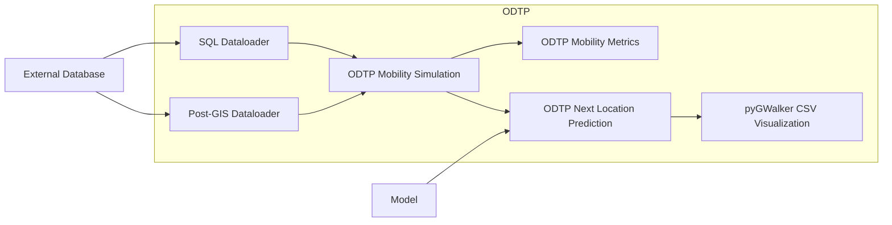

# dt-mobility-causal-intervention

This is a prototype of how to share a DT. 



In order to adapt this to the current ODTP pipeline, the workflow is executed in this order:

1. SQL-Dataloader
2. Post-GIS Dataloader
3. Mobility Simulation 
4. Mobility Metrics
5. Next Location Prediction
6. pyGWalker

## Tutorial

1. Clone this repository
2. Edit `dt-mobility-causal-intervention.sh` with the ODTP user email and the desired digital twin and execution name. 
3. Configure the parameters in `parameters`
4. Configure the secrets in `secrets`. Rename `001.secrets.dist` and `002.secrets.dist` to `001.secrets` and `002.secrets`. Add your credentials. 
5. Run the bash script in your odtp instance: `sh dt-mobility-causal-intervention.sh`


How to remove the execution? This command will delete any mongoDB entry and the content of the execution folder, allowing for a fresh execution.

```bash
odtp execution delete --execution-name execution --project-path $(pwd)/dt-mobility-causal-intervention/execution
```
