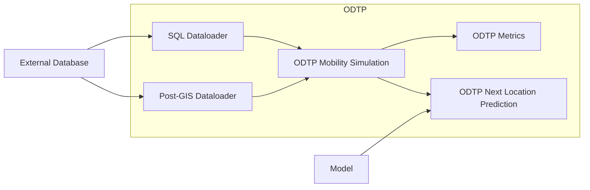

# dt-mobility-causal-intervention

This is a prototype of how to share a DT. 

```mermaid
graph LR
    ExternalDatabase[External Database] --> SQLDataloader[SQL Dataloader]
    ExternalDatabase --> PostGisDataloader[Post-GIS Dataloader]

    subgraph ODTP
        SQLDataloader --> ODTPMobilitySimulation[ODTP Mobility Simulation]
        PostGisDataloader --> ODTPMobilitySimulation
        ODTPMobilitySimulation --> ODTpMetrics[ODTP Metrics]
        ODTPMobilitySimulation --> ODTpNextLocationPrediction[ODTP Next Location Prediction]
    end

    Model[Model] --> ODTpNextLocationPrediction
```

## Tutorial

TBD